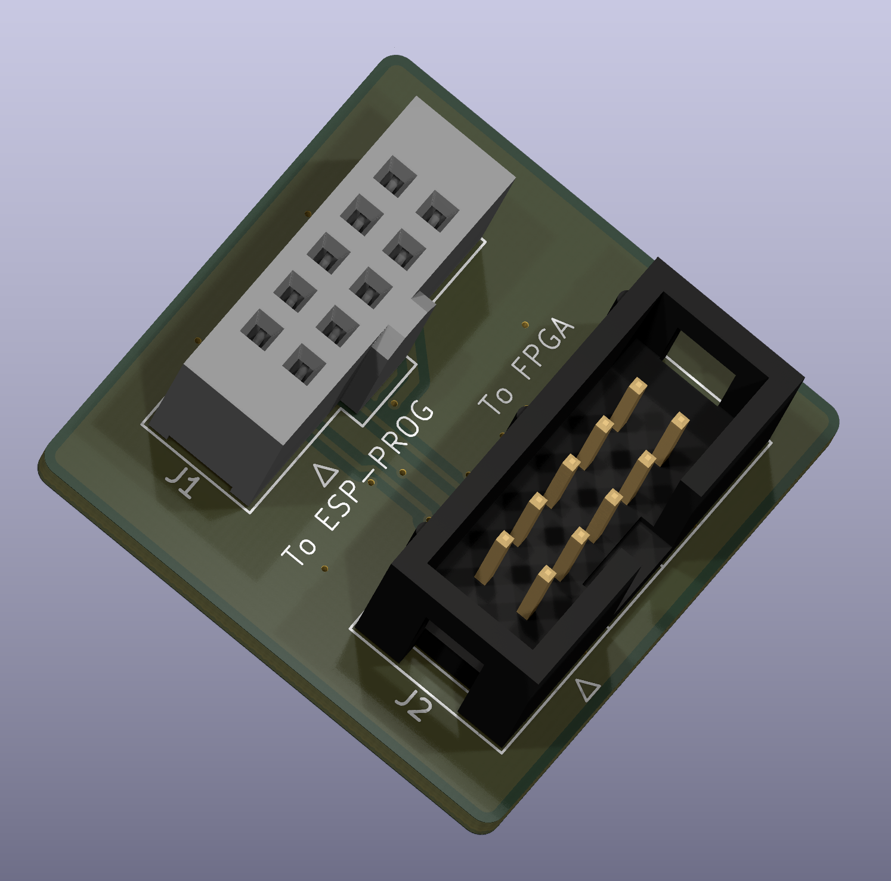
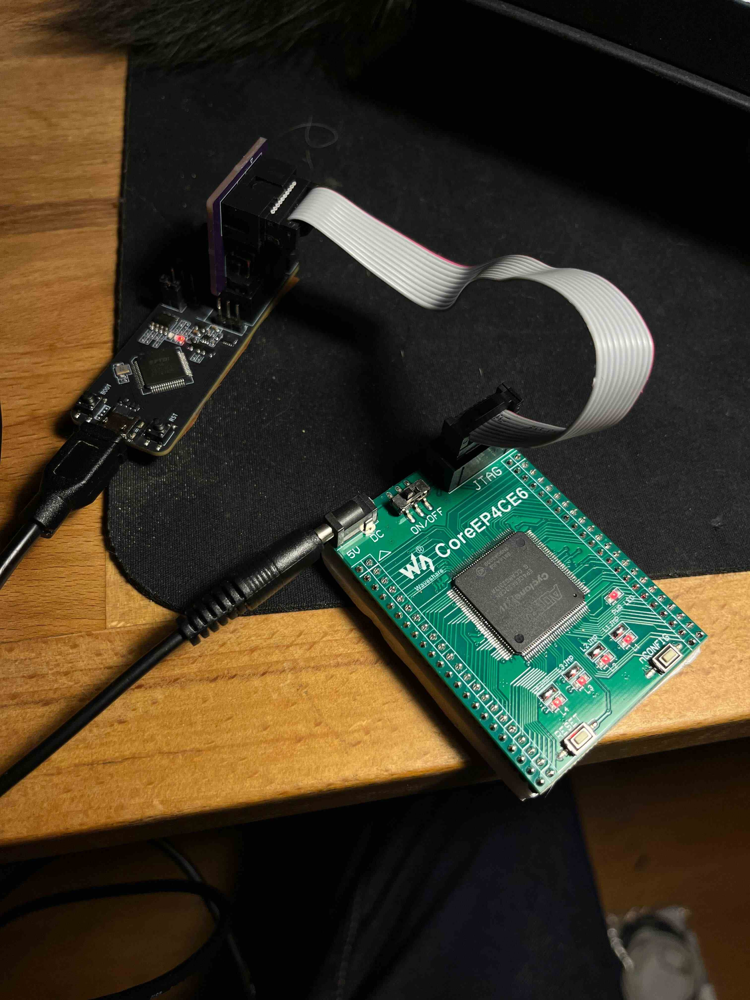

# ESP-Prog to Altera adapter

Lets you use a $10 [ESP-Prog](https://docs.espressif.com/projects/esp-iot-solution/en/latest/hw-reference/ESP-Prog_guide.html) programmer as the equivalent of an Altera USB Blaster.  

The FT2232HL on the ESP-Prog supports JTAG/MPSSE, which means you can use it to flash an FPGA using [openFPGALoader](https://trabucayre.github.io/openFPGALoader/compatibility/cable.html).  

This board can be ordered assembled from JLCPCB using the gerbers and BOM included in the release/ directory. Or you can hand solder it, obviously.  

# Update

It works. Tested with [Waveshare CoreEP4CE6](https://www.waveshare.com/wiki/CoreEP4CE6).

`openFPGALoader -c ft2232 --fpga-part ep4ce622 -f [binary].rbf`
